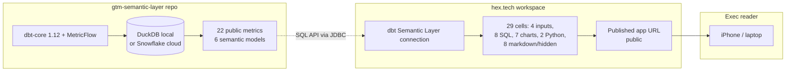

# Architecture

## Data flow

One-way, read-only. Hex never writes back. Every panel is a `semantic_layer.query(...)` Jinja macro executed via the dbt Semantic Layer SQL API from a native Hex connection; no raw-SQL joins live in Hex cells. The 7 primary SQL cells in `queries/*.sql` are copy-paste ready.

## Section + panel layout

Single scrollable canvas. Sticky top filter bar on all sections.

| Section | Panels | Primary reader |
|---|---|---|
| **S0 — Header + filters** | Title, "as of" timestamp, 4 filter inputs | Everyone |
| **S1 — Revenue state** | P1 ARR + sparkline, P2 NRR by cohort, P3 logo retention 24M | CRO, CFO |
| **S2 — Pipeline health** | P4 pipeline coverage (strict + QTD toggle) | VP Sales |
| **S3 — Funnel efficiency** | P5 funnel conversion, P6 CAC payback | VP Marketing, RevOps |
| **S4 — Appendix** | Methodology, data freshness, companion-repo link | Analytics Engineer peer review |

## Filters

| Filter | Hex input type | Default | Binds to |
|---|---|---|---|
| `as_of_date` | Date picker | Today | Every time dimension |
| `segment` | Multi-select | ALL | `account__segment` |
| `region` | Multi-select | ALL | `account__region` |
| `product_line` | Multi-select | ALL | Not yet modeled in companion; filter is a no-op until Day 6+ companion mod |

## Cell order

29 cells top-to-bottom per design doc §2.1. Hidden in reader view: `q_data_freshness`, `py_refresh_ts`, `py_pivot_matrix`, `q_debug_rowcounts`.

## Non-functional targets

- Initial load: <= 6s cold (Hex caches cell results)
- Filter change latency: <= 2s (semantic layer pre-aggregates at month/quarter grain)
- Mobile viewport: iPhone 13+ renders without horizontal scroll (Hex mobile view, explicit layout)
- Freshness policy: "Data as of <= 24h ago" shown in header
- Published link: public, no auth (portfolio artifact, synthetic data in companion)

## Metric-name reconciliation (design doc vs companion)

The design doc at `_designs/04-anthropic-hex-app.md` was written before the companion repo stabilized. Final metric names in `gtm-semantic-layer`:

| Design doc proposed | Actual metric |
|---|---|
| `net_revenue_retention` | `nrr` |
| `logo_retention_rate` | `logo_retention` |
| `pipeline_coverage_ratio` | `pipeline_coverage` + `pipeline_coverage_qtd` (sibling) |
| `mql_to_sql_rate`, `sql_to_won_rate` | `mql_to_sql_conv`, `sql_to_won_conv` |
| `stage_weighted_pipeline_amount` | `weighted_pipeline_arr` |
| `cac_payback_months` | matches |
| `arr` | matches |

Dimensions:

| Design doc | Actual |
|---|---|
| `customer__segment` | `account__segment` |
| `customer__region` | `account__region` |
| `product__line` | not yet modeled; filter is no-op |
| `opportunity__region` | `opportunity__owner_team` (team, not region) |
| `lead__source` | not yet modeled |

The queries in `queries/*.sql` use the ACTUAL names.
